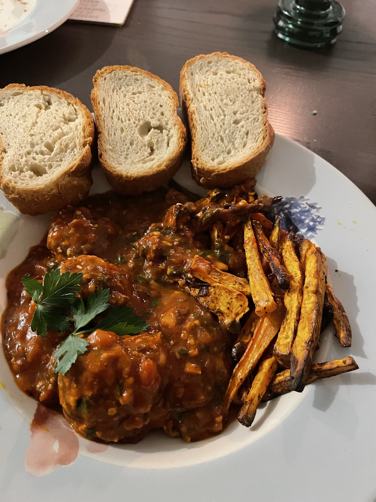

# 🍅 Vegetarische / Vegane Albóndigas


<small>Foto: Apfel-Tiramisu mit karamellisierten Zimt-Apfelwürfeln.</small>


### Zutaten (für ca. 4 Portionen / ~ 12 – 16 Bällchen)

Für die Bällchen:
	•	500 g pflanzliches Hack (z. B. “myvay” oder anderes veganes Hack)  
	•	1 kleine Zwiebel, fein gehackt  
	•	2–3 Knoblauchzehen, fein gehackt  
	•	2 EL Paniermehl (oder Semmelbrösel bzw. glutenfrei: Paniermehl-Ersatz)  
	•	ca. ½ Bund frische Petersilie, fein gehackt  
	•	optional: 20 g gehackte & geröstete Pinienkerne – das gibt einen schönen Biss und Geschmack.  
	•	Gewürze: 1 TL edelsüßes Paprikapulver, Salz, Pfeffer; optional eine Prise Kreuzkümmel (für ein kleines Aroma-Extra).  
	•	Olivenöl zum Anbraten.  

Für die Tomatensauce:
	•	500 g frische Tomaten (hochreif) oder eine gute Dose stückiger Tomaten.  
	•	2 EL Tomatenmark (um die Sauce intensiver zu machen)  
	•	1 Zwiebel, fein gehackt  
	•	2 Knoblauchzehen, fein gehackt  
	•	50 ml trockener Rotwein (gibt Geschmackstiefe)
	•	evtl. 1 Lorbeerblatt
	•	evtl. 1 TL frischer Thymian oder getrockneter Thymian (alternativ mediterrane Kräuter wie Oregano/Thymian) 
	•	evtl. 1 TL Zucker (balanciert die Säure der Tomaten)  
	•	Salz, Pfeffer, Olivenöl zum Anbraten.  

Zubereitung
	1.	Bällchen vorbereiten:
	•	Zwiebel und Knoblauch fein hacken, Petersilie ebenfalls klein schneiden.
	•	In einer großen Schüssel das vegane Hack mit Zwiebel, Knoblauch, Petersilie, Paniermehl (und optional Pinienkerne) gut vermengen. Paprikapulver, Salz, Pfeffer (und optional Kreuzkümmel) einarbeiten. Mit den Händen ca. 12 – 16 gleichmäßige Bällchen formen.  
	•	Tipp: Wenn du willst, kannst du die Bällchen leicht in Mehl wälzen — das hilft, dass sie nach dem Anbraten in der Sauce schön Form behalten und nicht zerfallen.  
	2.	Anbraten:
	•	In einer Pfanne etwas Olivenöl erhitzen. Die Albóndigas rundum anbraten, bis sie schön gebräunt sind. Sie müssen nicht komplett durchgegart sein — sie garen später in der Sauce fertig.  
	3.	Tomatensauce zubereiten:
	•	In derselben oder einer zweiten Pfanne etwas Olivenöl erhitzen. Zwiebel und Knoblauch glasig dünsten. Wenn du Chili nutzt: hinzufügen und kurz mitrösten. Dann das Tomatenmark kurz mitrösten.  
	•	Mit Rotwein ablöschen (oder Gemüsebrühe/Wasser). Die Tomaten (oder Dosentomaten) zugeben, Kräuter und Lorbeerblatt einlegen, Salz, Pfeffer, Zucker dazu. Alles ca. 15–20 Minuten bei mittlerer Hitze köcheln lassen, bis die Sauce schön eingedickt ist.  
	•	Wer mag: Sauce am Ende etwas pürieren, damit sie sämiger wird (optional).
	4.	Bällchen fertig garen:
	•	Die angebratenen Albóndigas vorsichtig in die fertige Tomatensauce geben. Bei niedriger Hitze weitere 5–10 Minuten mitköcheln lassen, damit sie die Aromen aufnehmen und durchziehen können.  
	•	Lorbeerblatt entfernen. Abschmecken und ggf. nachwürzen.
	5.	Servieren:
	•	Mit frisch gehackter Petersilie bestreuen.
	•	Dazu passen wunderbar Baguette, rustikales Brot, Reis oder auch etwas grüner Salat. Als kleine Tapas mit Oliven und Brot — perfekt.  

    ---

### Hinweise zur Bildgröße & Vorschau
- Bild: `albondigas.jpeg` liegt im selben Ordner wie dieser Post. Wenn das Theme Bildgrößen skaliert, kannst du eine kleinere, optimierte Version (z. B. 1200px Breite) in den gleichen Ordner legen.
- Optionales CSS (in `assets/css` oder deinem Theme-Overrides), um das Bild zu zentrieren und max-Breite zu begrenzen:

```css
.post-image--center {
  display: block;
  margin: 0.75rem auto;
  max-width: 900px;
  width: 100%;
  height: auto;
}
```

Füge dann die Klasse zur Bild-Markdown-Zeile hinzu, falls dein Parser HTML im Markdown erlaubt:

```html

```

Lokale Vorschau (zsh / macOS):

```bash
# Installiere Gems falls nötig: bundle install
# Dann lokal starten:
bundle exec jekyll serve --livereload
```

Wenn du möchtest, optimiere ich das Bild noch (Größe/Qualität) oder füge die CSS-Datei hinzu. 